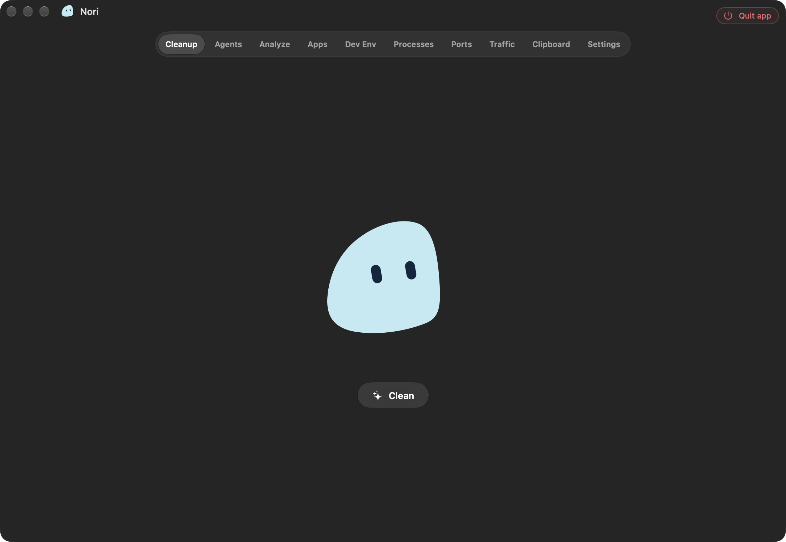
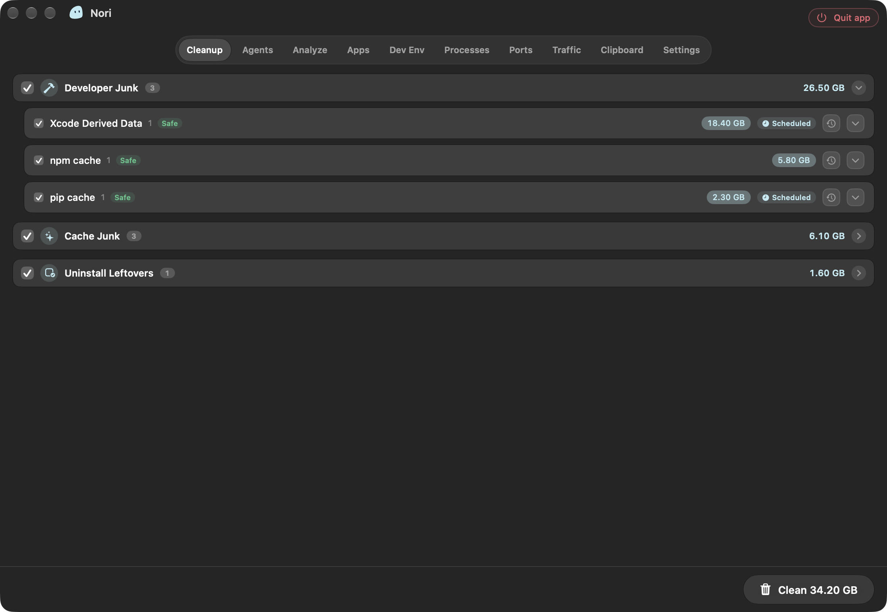
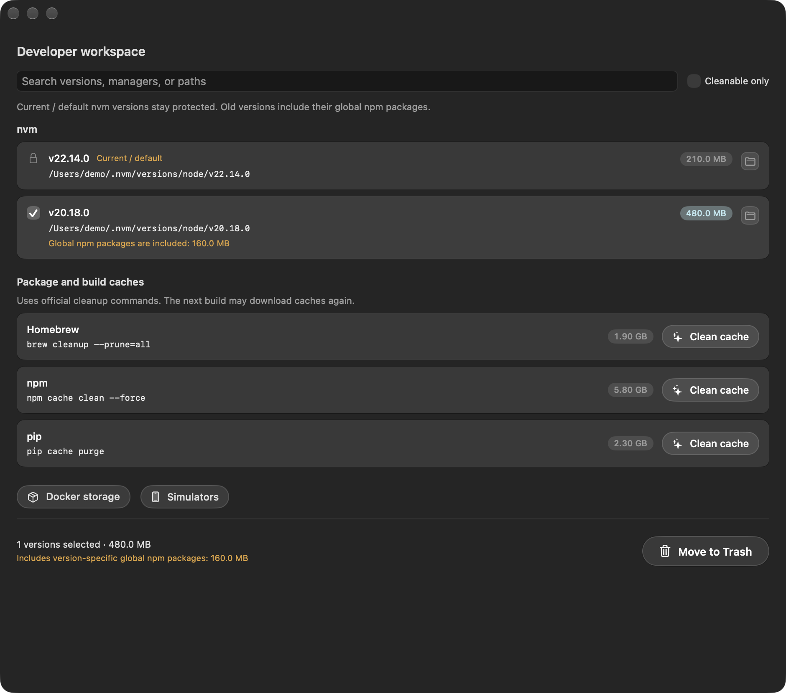
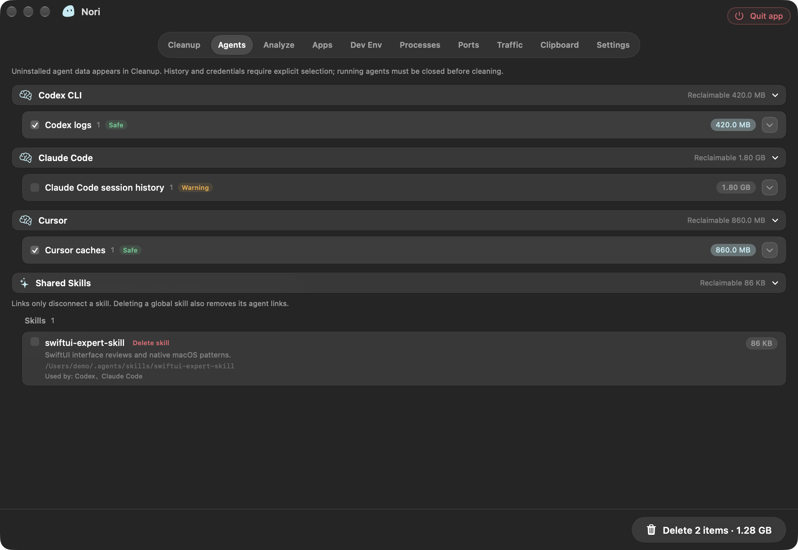
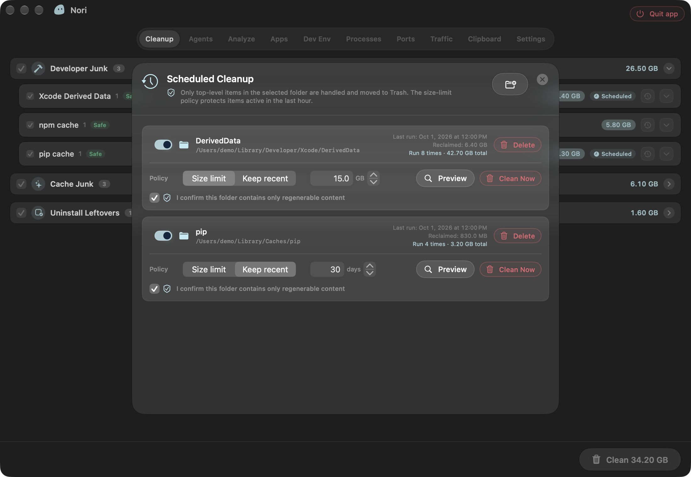
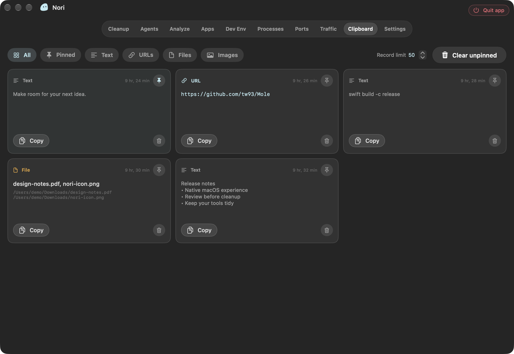
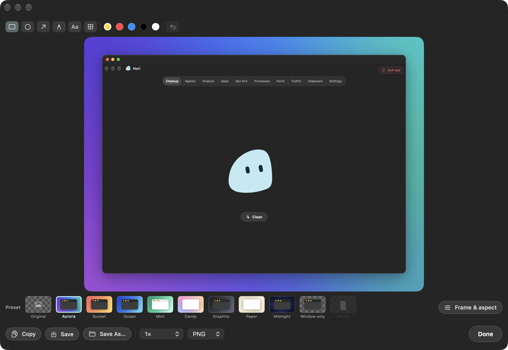
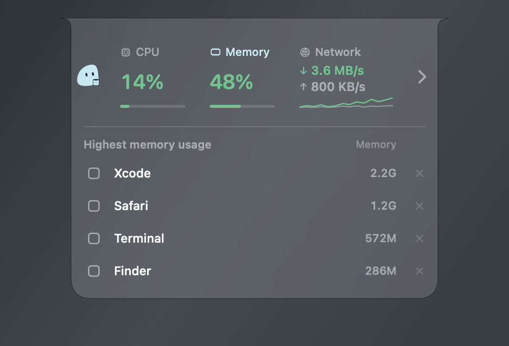

# Nori

**A quieter, cleaner Mac.**

A native, lightweight macOS companion that helps you reclaim disk space, keep an eye on your Mac, and make everyday work a little easier. Nori brings a Dynamic Island-inspired interface and Liquid Glass to a practical set of cleanup, developer, AI agent, and productivity tools.

[Download the latest release](https://github.com/percentcola3/sweep/releases/latest) · [简体中文](README.zh-CN.md) · [Development guide](docs/development.md)



Nori is inspired by [Mole](https://github.com/tw93/Mole), the excellent Mac cleanup tool by [tw93](https://github.com/tw93). Its Swift and SwiftUI interface, native core services, and focused helper scripts bring that spirit to a visual Mac companion. Audited Mole helper libraries are included with attribution under GPL v3.

## Why Nori

- **Made for macOS.** A native Swift + SwiftUI app with a menu bar home, a compact island, and Liquid Glass on macOS 26 and later.
- **Space where it matters.** Find rebuildable application caches, developer downloads, and old build artifacts. A developer Mac can accumulate tens of GB of reclaimable data; your results depend on what is actually on disk.
- **Understands your tools.** Dedicated developer and AI agent inventories distinguish disposable caches from sessions, credentials, and project data.
- **A quiet guardian.** Watch CPU, memory, disk, network, and battery information without keeping the main window open.
- **Useful every day.** Scheduled folder cleanup, local clipboard history, and configurable screenshot shortcuts live in the same app.

## Reclaim disk space

Quick Scan finds common cleanup targets; Deep Scan looks through additional application caches and containers. Review sizes by category, expand individual items, and choose what to remove.

Nori recognizes application and browser caches, logs, diagnostic reports, Trash, developer caches, AI caches, and verified uninstall leftovers. Developer caches and build artifacts are recommended after **seven days without activity**. Recently used items stay visible without being selected by default, and running applications or reopened files can cause an item to be skipped before cleanup.



The main cleanup action **permanently deletes** the selected disposable files after confirmation. Disk analysis helps you investigate larger files yourself; exact duplicates and similar images can be reviewed and moved to Trash while keeping at least one copy. App uninstall also previews the app and its associated data before moving confirmed items to Trash.

## Built for developer Macs

Package managers and build systems leave more behind than ordinary app caches. Nori recognizes these environments and provides targeted cleanup:

| Environment | What Nori can clean or manage |
| --- | --- |
| Xcode, SwiftPM, Carthage | DerivedData, downloaded package/build caches, Xcode caches, simulator caches, test-device clones, and unavailable simulators. Xcode archives stay protected. |
| Node.js: npm, pnpm, Yarn, Bun, Corepack | Package/download caches and official cache cleanup or store pruning commands. Old nvm versions can move to Trash; current and default versions are protected. |
| Frontend tooling | Recognized node-gyp, TypeScript, Electron, Turborepo, Vite, Webpack, Parcel, ESLint, and Prettier cache locations. |
| Python: pip, uv, Poetry, Conda | Package/download caches and available official cleanup commands. Poetry virtual environments are excluded from ordinary cache cleanup. |
| Java / Android: Gradle | Build caches, daemon logs, worker scratch files, and notification state; module dependencies are treated separately. |
| Rust / Go | Cargo registry download caches, Go build caches and module download caches; Go’s official cleanup commands are also available. |
| Homebrew / Ruby | Homebrew downloads and `brew cleanup`; RubyGems cleanup when the tool is installed. |
| .NET / PHP / other build tools | NuGet and Composer caches, plus recognized Bazel and Zig caches. |
| Docker | Storage inventory and explicit builder/system pruning through Docker’s own commands. |



The developer workspace also inventories fnm, Volta, asdf, pyenv, rbenv, rustup, Homebrew runtimes, JDKs, Bun, and Deno, alongside shell, network, hosts, and CLI tools. Runtime removal outside nvm is delegated to the owning manager. Custom npm, Yarn, pip, Poetry, Gradle, Cargo, and Go cache locations are recognized when their configuration is available to Nori.

Dependency stores such as Maven’s local repository, Gradle modules, NuGet packages, Dart’s pub cache, and Cargo source/git trees are **excluded from one-click cleanup**. Dedicated actions use the owning tool where supported; these stores may require downloads or contain locally installed artifacts.

## Cleanup that understands AI agents

AI tools accumulate more than cache files. Nori groups each tool’s data so you can see what can be rebuilt, what contains history, and what needs extra care.

| Recognized tools | Cleanup and review examples |
| --- | --- |
| Claude Code, Claude Desktop | Old CLI versions, statistics/update and desktop caches; review transcripts, file snapshots, plans, attachments, backups, and Cowork VM data. |
| Codex CLI, Codex App | Temporary files, file logs, model-list and desktop/browser caches; review archived sessions, generated images, log databases, and backups. |
| Cursor, Cursor CLI | Desktop/update/compile caches and old CLI versions; review checkpoints and inspect chat databases, workspace state, and worktrees separately. |
| GitHub Copilot CLI | Old versions, logs and caches; review session-state files and command history. |
| Gemini CLI, Antigravity | Review Gemini session/history data and Antigravity browser recordings; clean recognized Antigravity desktop caches. |
| OpenCode | Caches and logs; review snapshots, tool output, plans, and legacy session storage. |
| Grok CLI, pi, Kimi | Recognized old versions, logs, or temporary caches where available; review sessions, input history, plans, and generated attachments. |
| Factory Droid | Review sessions, logs, cache/temp data, and specifications. |
| Devin, Windsurf | Desktop caches; inspect shared Cascade history and memories separately. |
| Zed, Warp | Recognized caches, logs, or hang traces; inspect conversation/state databases separately. |
| Chrome DevTools MCP | Recognized browser-profile caches; Service Worker storage requires review. |
| Qoder, Kiro, Trae, Amp, Crush | Identify local data and resources. Unknown or persistent data requires explicit review; Crush also recognizes selected project data and logs. |



**Review history separately.** Only items classified as disposable are selected by default. Sessions, checkpoints, memories, worktrees, VM data, credentials, and uncertain storage are excluded from that default selection and carry their own risk information. Removing history or credentials can lose work or require signing in again.

The dedicated agent cleanup button applies selected actions immediately, without a second confirmation dialog. Selected file deletions are **permanent**, bypassing Trash; review the selection and back up anything you need before using it.

Nori also inventories supported global **Skills, MCP registrations/local installations, and CLI installations**, shows known consumers of shared resources, and separates unlinking a resource from removing its files. Recognition follows known installation layouts; it does not imply complete coverage of every plugin or custom data directory. See the [agent coverage and evidence matrix](docs/agent-cleanup-research/README.md).

## Keep folders tidy automatically

Create rules for folders you choose: **keep the last X days** or **stay below a size limit**. Preview a rule before enabling it, or run it manually when you want to check the result.



Rules start disabled. While Nori is running, it checks schedules hourly, with at least six hours between actual scans. Rules work on the folder’s immediate children, protect sensitive/project locations and recently written content, and move approved items to Trash. Emptying Trash is a separate step to reclaim the space.

## A clipboard you can return to

Enable local clipboard history for **text, links, files, and images**. Filter by type, pin what you reuse, copy an item again, adjust the history limit, and clear unpinned entries in one action. File entries retain paths rather than duplicating your files.



History is stored on your Mac. Nori skips content marked concealed or transient by cooperating apps; unmarked sensitive text can still enter history, so enable the feature according to your workflow.

## Capture, compose, share

Use **⌘⇧S** for interactive region/window capture and **⌘⇧R** for capture at a chosen aspect ratio. Both shortcuts can be changed in Settings.



Annotate with shapes, arrows, freehand strokes, text, or mosaic redaction. Add gradient backgrounds, padding, rounded frames, a Mac window, or an iPhone frame for phone-ratio captures; choose an output aspect ratio and export PNG or JPEG at 1× or 2×. Your last composition and export settings are remembered.

## Your Mac, at a glance

The Dynamic Island-inspired panel stays near the top of the screen. Hover to see CPU and memory rings, view the applications using resources, and open the main window. Its resource actions attempt a normal quit for eligible background apps; memory cleanup can also release Nori’s own caches.



The menu bar and main window offer CPU, memory, disk usage and I/O, network rates, battery information, processes, listening ports, and application traffic. Liquid Glass transitions adapt to Reduce Motion, and older macOS versions or Reduce Transparency use fallback surfaces.

*The English and Chinese screenshots show the app’s actual UI components rendered with sample data. Their sizes, histories, and cleanup results are illustrative, not a benchmark or a scan of a personal Mac.*

## Install and update

Requires **macOS 13 Ventura or later**. Native Liquid Glass requires macOS 26 or later.

1. Open [GitHub Releases](https://github.com/percentcola3/sweep/releases/latest).
2. Download `Nori-arm64.dmg` for Apple silicon or `Nori-x86_64.dmg` for Intel.
3. Drag `Nori.app` into `/Applications`, replacing an older Nori after quitting it.
4. Open Nori and use its permission center to grant **Full Disk Access** for cleanup/scanning. **Screen Recording** is requested separately for screenshots.

Public releases reuse the **same pinned signing certificate and `com.nori.app` bundle identifier**. The release scripts verify this identity and fail if it changes or is missing, helping macOS recognize Nori across updates. This is a fixed self-signed identity, **not Apple notarization**, and cannot guarantee that every macOS version preserves all privacy permissions. If macOS blocks the first launch, use **System Settings → Privacy & Security → Open Anyway** when available; you do not need to install the signing certificate.

Upgrading from an ad-hoc/development build, a differently signed app, or the former ForgeSweep bundle identifier may require one-time permission renewal. Read the [signing and upgrade guide](docs/release-signing.md) for identity verification and release validation.

## Languages

English, 简体中文, 繁體中文, 日本語, 한국어, Deutsch, Français, Español, Português, Italiano, Русский, and Türkçe. Nori follows your system language by default; switch instantly in Settings.

## Build and contribute

A Mac and an Xcode toolchain with `swiftc` are required. For a local development build:

```bash
bash script/dev_identity.sh --ensure
bash script/build_and_run.sh
```

Run the regression suite with `bash script/test.sh`. Local development signatures are separate from the pinned release identity. Architecture, build options, safety policies, and maintenance notes are in the [development guide](docs/development.md); maintainers should follow the [release signing guide](docs/release-signing.md) when packaging public builds.

Bug reports and focused contributions are welcome through [Issues](https://github.com/percentcola3/sweep/issues) and pull requests. For cleanup reports, include your macOS version, Nori version, the tool involved, and a redacted path or log when useful.

## License and acknowledgments

Nori is open source under the [GNU General Public License v3.0](LICENSE). Mole’s vendored source retains its [GPL v3 license](vendor/mole/LICENSE); upstream attribution and packaged components are documented in [Third-party notices](THIRD_PARTY_NOTICES.md).

Thank you to [tw93/Mole](https://github.com/tw93/Mole) for the inspiration and foundational cleanup work.
