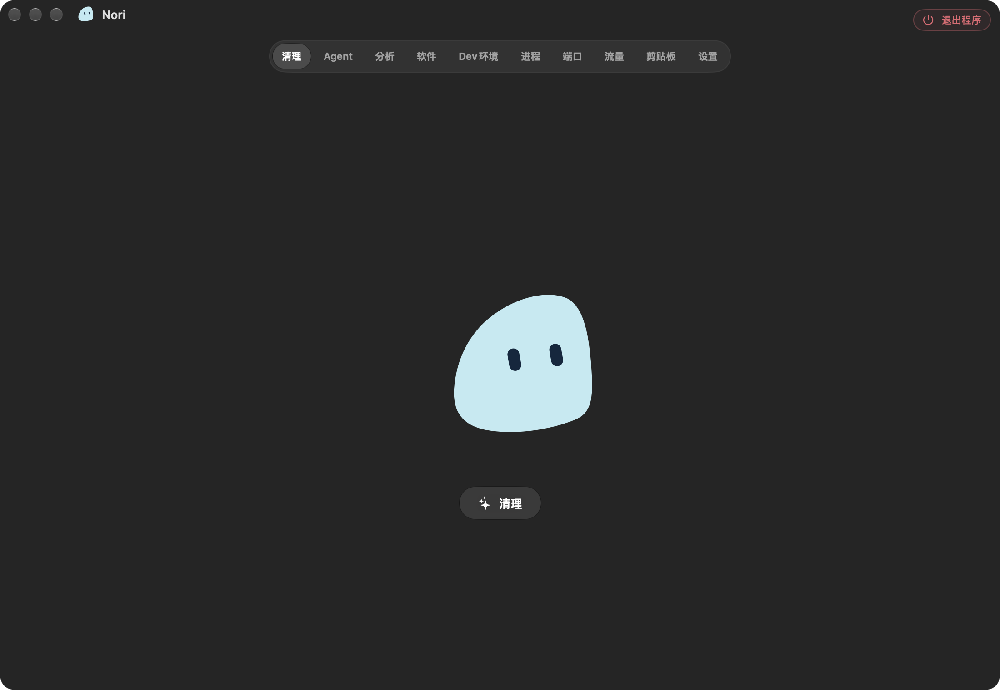
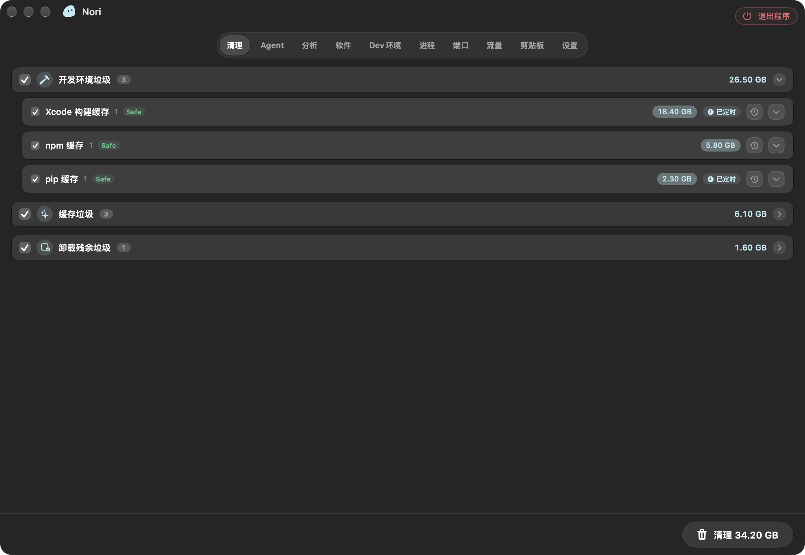
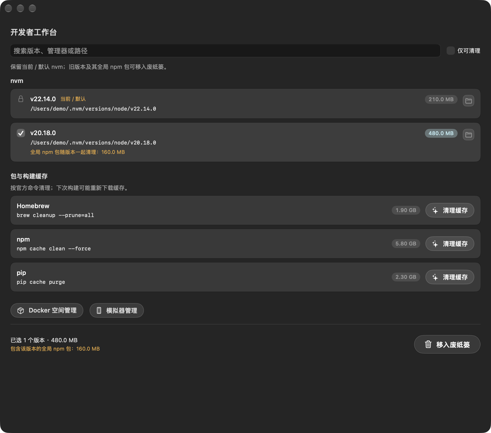
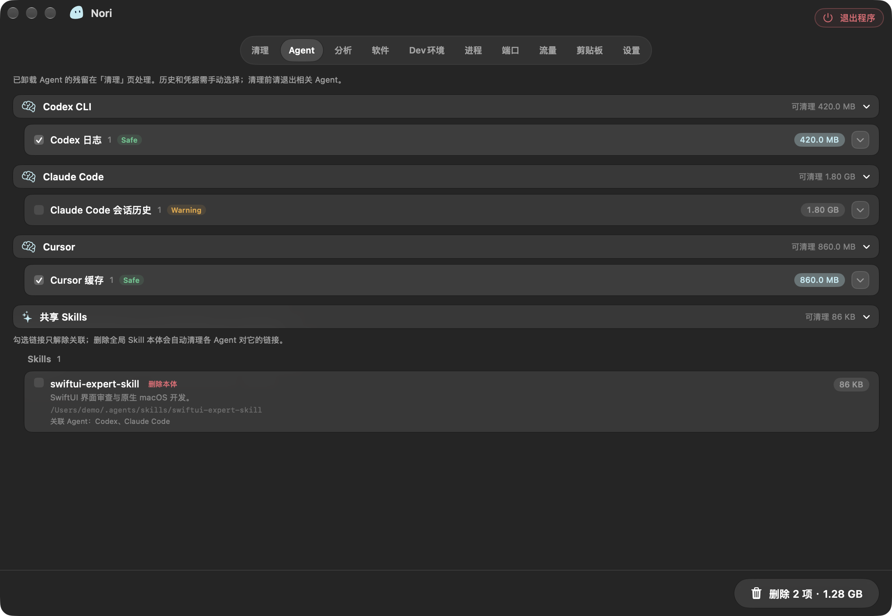
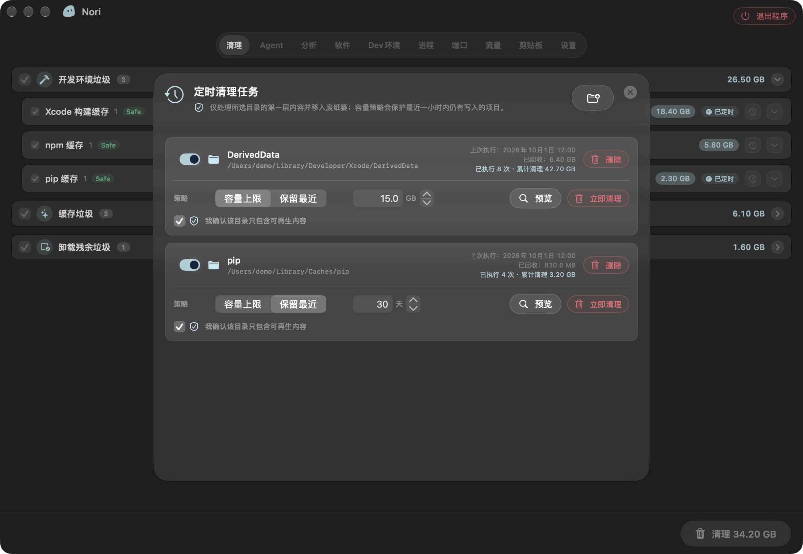
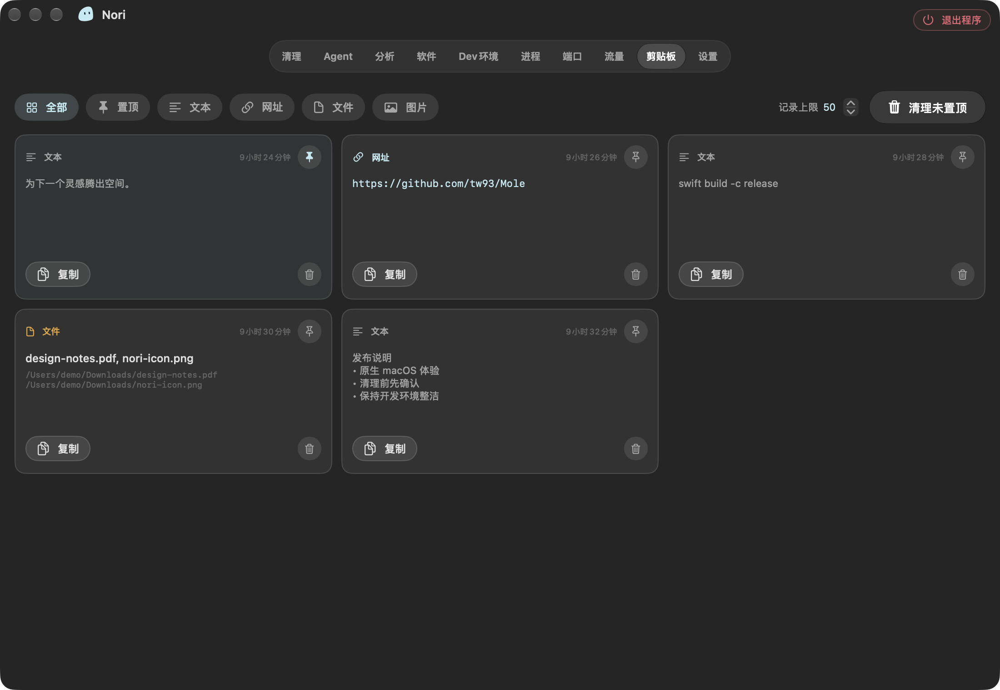
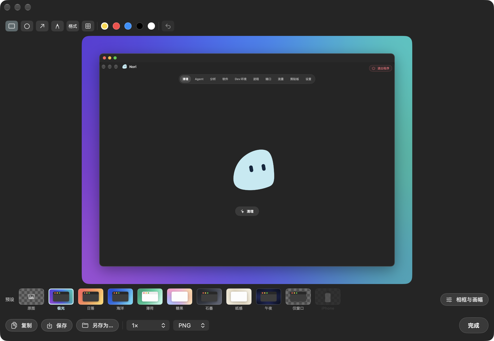
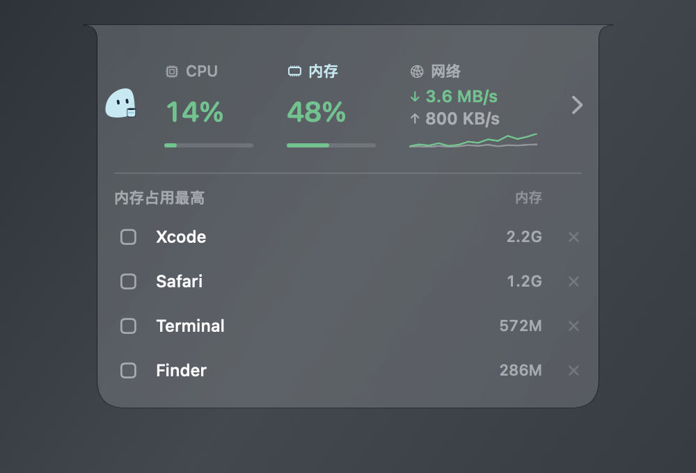

# Nori

**让 Mac 更清爽，也更安心。**

Nori 是一个原生、轻量的 macOS 增强工具，帮你清理磁盘、守护系统状态，也让日常工作更顺手。以灵动岛风格的交互和液态玻璃为入口，把清理、开发者工具、AI Agent 管理和效率功能放进一个安静的 Mac 伙伴里。

[下载最新版本](https://github.com/percentcola3/sweep/releases/latest) · [English](README.md) · [开发与维护](docs/development.md)



Nori 受到 [tw93](https://github.com/tw93) 的 [Mole](https://github.com/tw93/Mole) 启发。我们用 Swift 和 SwiftUI 原生界面、原生核心服务以及专用辅助脚本，将这种实用的清理理念带到可视化的 Mac 工具中。项目保留经过审计的 Mole 辅助库，并遵守 GPL v3 及上游署名要求。

## 为什么选择 Nori

- **原生 macOS 体验。** Swift + SwiftUI，常驻菜单栏、顶部灵动岛；macOS 26 及以上使用原生液态玻璃。
- **清理真正占空间的内容。** 找出可重建的应用缓存、开发依赖下载和旧构建产物。开发者的 Mac 可能积累几十 GB 可回收内容，实际结果取决于你的磁盘。
- **理解你的工具。** 专门识别开发环境和 AI Agent，区分缓存、会话、凭据与项目数据。
- **安静守护。** 随时关注 CPU、内存、磁盘、网络和电池，不需要一直打开主窗口。
- **每天都用得上。** 定时目录清理、本地剪贴板历史、可自定义的截图快捷键，集中在同一个 App。

## 一次清理，找回磁盘空间

快速扫描寻找常见清理目标，深度扫描进一步检查应用缓存和容器。按分类查看占用、展开具体条目，自行选择要清理的内容。

Nori 识别应用与浏览器缓存、日志、诊断报告、废纸篓、开发者缓存、AI 缓存，以及归属明确的卸载残留。开发者缓存和构建产物默认在 **连续 7 天未活跃**后推荐清理。最近使用的条目仍然可见，但默认不勾选；执行前重新检查，正在运行的应用或重新打开的文件可能被跳过。



主清理操作在确认后会**永久删除**所选可丢弃文件。磁盘分析帮助你进一步查找大文件；重复文件和相似图片由你逐项审查，移入废纸篓时每组至少保留一份。应用卸载也会先展示应用本体和关联数据，再将确认的项目移入废纸篓。

## 为开发者的 Mac 准备

包管理器和构建系统留下的内容，远不止普通应用缓存。Nori 识别以下环境并提供专门清理能力：

| 环境 | 可以清理或管理的内容 |
| --- | --- |
| Xcode、SwiftPM、Carthage | DerivedData、软件包下载与构建缓存、Xcode 缓存、模拟器缓存、测试设备克隆及不可用模拟器；Xcode Archives 保持保护。 |
| Node.js：npm、pnpm、Yarn、Bun、Corepack | 软件包与下载缓存、官方缓存清理和 store prune 命令；旧 nvm 版本可移入废纸篓，当前与默认版本受保护。 |
| 前端工具链 | 已知位置的 node-gyp、TypeScript、Electron、Turborepo、Vite、Webpack、Parcel、ESLint、Prettier 缓存。 |
| Python：pip、uv、Poetry、Conda | 软件包与下载缓存、可用的官方清理命令；Poetry 虚拟环境不进入普通缓存清理。 |
| Java / Android：Gradle | 构建缓存、daemon 日志、worker 临时数据和通知状态；模块依赖独立处理。 |
| Rust / Go | Cargo registry 下载缓存、Go 构建和模块下载缓存；也提供 Go 官方清理命令。 |
| Homebrew / Ruby | Homebrew 下载缓存和 `brew cleanup`；安装 RubyGems 时提供对应清理。 |
| .NET / PHP / 其他构建工具 | NuGet、Composer 缓存，以及已知位置的 Bazel、Zig 缓存。 |
| Docker | 空间占用明细，明确选择后通过 Docker 官方命令清理 builder / system。 |



开发者工作台还会识别 fnm、Volta、asdf、pyenv、rbenv、rustup、Homebrew 运行时、JDK、Bun 和 Deno，并提供 Shell、网络、hosts 和 CLI 工具管理。nvm 以外的运行时移除交给所属管理器。当配置对 Nori 可见时，也能识别 npm、Yarn、pip、Poetry、Gradle、Cargo 和 Go 的自定义缓存位置。

Maven 本地仓库、Gradle 模块、NuGet packages、Dart pub cache、Cargo source/git 等依赖库**不进入一键清理**。支持的专用操作交给工具自身执行；这些目录可能需要重新下载，也可能包含只保存在本机的构建产物。

## 理解 AI Agent 的清理

AI 工具留下的并不都是缓存。Nori 按工具整理本地数据，让你看清哪些内容可重建、哪些包含历史、哪些需要谨慎处理。

| 可识别工具 | 清理与审查示例 |
| --- | --- |
| Claude Code、Claude Desktop | 旧 CLI 版本、统计/更新缓存、桌面缓存；审查项目转录、文件快照、计划、附件、备份及 Cowork VM 数据。 |
| Codex CLI、Codex App | 临时文件、文件日志、模型目录缓存、桌面与内置浏览器缓存；审查归档会话、生成图片、日志库和备份。 |
| Cursor、Cursor CLI | 桌面/更新/编译缓存、旧 CLI 版本；审查检查点，独立查看聊天数据库、工作区状态和 worktree。 |
| GitHub Copilot CLI | 旧版本、日志、缓存；审查 session-state 和命令历史。 |
| Gemini CLI、Antigravity | 审查 Gemini 会话/历史和 Antigravity 浏览器录像；清理已知 Antigravity 桌面缓存。 |
| OpenCode | 缓存、日志；审查快照、工具输出、计划和旧版会话存储。 |
| Grok CLI、pi、Kimi | 按各工具实际支持情况识别旧版本、日志或临时缓存；审查会话、输入历史、计划和生成附件。 |
| Factory Droid | 审查会话、日志、cache/temp 数据和 specs。 |
| Devin、Windsurf | 桌面缓存；独立查看共享 Cascade 历史和 memories。 |
| Zed、Warp | 已知缓存、日志或 hang traces；独立查看会话与状态数据库。 |
| Chrome DevTools MCP | 已知浏览器 profile 缓存；Service Worker 存储需要审查。 |
| Qoder、Kiro、Trae、Amp、Crush | 识别本地数据与资源；未知或持久数据需明确审查。Crush 还识别部分项目数据和日志。 |



**缓存和会话分开看。** 默认只勾选判定为可丢弃的内容。会话、检查点、记忆、worktree、VM 数据、凭据及结构不明的存储不进入默认选择，并带有各自的风险说明。删除历史或凭据可能丢失工作记录，或需要重新登录。

Agent 专清按钮会直接执行所选操作，没有第二次确认弹窗。选中文件的删除是**永久删除**，不经过废纸篓；使用前请核对选择，并备份仍需保留的内容。

Nori 同时识别支持范围内的全局 **Skills、MCP 登记与本地安装、CLI 安装实例**，展示共享资源的已知使用者，并区分“解除关联”与“删除文件”。识别遵循已知安装结构，不代表所有插件和自定义目录都已覆盖。完整范围见 [Agent 覆盖与取证矩阵](docs/agent-cleanup-research/README.md)。

## 定时整理你选定的目录

为目录设置**保留最近 X 天**或**容量上限**。启用前先预览规则，也可以随时手动执行并查看结果。



规则添加后默认关闭。Nori 运行期间每小时检查调度，实际扫描至少间隔 6 小时。规则只处理目录的第一层子项，保护敏感/项目路径和近期写入内容，并将符合条件的项目移入废纸篓；清空废纸篓后才会实际释放对应空间。

## 随时找回复制过的内容

开启本地剪贴板历史，记录**文本、链接、文件和图片**。按类型筛选、置顶常用内容、再次复制、调整历史容量，或者一键清除未置顶条目。文件条目只保存路径，不额外复制原文件。



历史保存在你的 Mac。Nori 会跳过配合应用标记为 concealed 或 transient 的内容；没有相应标记的敏感文本仍可能被记录，请按自己的工作习惯启用。

## 截图、排版、分享

使用 **⌘⇧S** 交互式选择区域或窗口，使用 **⌘⇧R** 按指定比例截图。两个快捷键都可以在设置里修改。



用形状、箭头、画笔、文字或马赛克进行标注。添加渐变背景、留白、圆角相框或 Mac 窗口；手机比例截图还可以使用 iPhone 外框。选择输出比例，再导出 1× / 2× 的 PNG 或 JPEG。Nori 会记住上次使用的排版和导出设置。

## 抬眼就能看到 Mac 的状态

灵动岛风格的顶部面板，悬停展开 CPU 与内存进度环、查看资源占用应用，并快速打开主窗口。资源清理会尝试正常退出符合策略的后台应用；内存清理也可释放 Nori 自身缓存。



菜单栏和主窗口提供 CPU、内存、磁盘容量与读写、网络速率、电池信息、进程、监听端口及应用流量。液态玻璃过渡适配“减少动态效果”；较早 macOS 或启用“减少透明度”时使用回退材质。

*中英文截图均使用 App 的真实界面组件和示例数据渲染。容量、历史和清理结果仅作演示，不是性能基准，也不是对个人 Mac 的真实扫描。*

## 安装与更新

需要 **macOS 13 Ventura 或更高版本**。原生液态玻璃需要 macOS 26 或更高版本。

1. 打开 [GitHub Releases](https://github.com/percentcola3/sweep/releases/latest)。
2. Apple 芯片下载 `Nori-arm64.dmg`，Intel 下载 `Nori-x86_64.dmg`。
3. 将 `Nori.app` 拖入 `/Applications`；更新前先退出旧 Nori，再覆盖安装。
4. 打开 Nori，通过权限中心授予清理与扫描所需的**完全磁盘访问**。截图使用独立的**屏幕录制**权限。

公开版本复用**同一份固定签名证书和 `com.nori.app` Bundle ID**。发布脚本会验证身份，证书变化或缺失时直接失败，帮助 macOS 在更新后继续识别同一个 App。这是固定自签名身份，**不等于 Apple 公证**，也无法保证所有 macOS 版本都保留全部隐私授权。首次启动若被拦截，可在提供该选项时使用**系统设置 → 隐私与安全性 → 仍要打开**；用户不需要安装签名证书。

从 ad-hoc / 本地开发构建、其他签名或旧 ForgeSweep Bundle ID 迁移，可能需要重新授权一次。身份校验和更新验证见 [发布签名与升级指南](docs/release-signing.md)。

## 多语言

English、简体中文、繁體中文、日本語、한국어、Deutsch、Français、Español、Português、Italiano、Русский、Türkçe。默认跟随系统语言，也可以在设置中即时切换。

## 构建与参与

需要 Mac 和提供 `swiftc` 的 Xcode 工具链。本地开发构建：

```bash
bash script/dev_identity.sh --ensure
bash script/build_and_run.sh
```

运行 `bash script/test.sh` 执行回归检查。本地开发签名与固定发布签名是不同身份。架构、构建选项、安全策略及维护说明见 [开发文档](docs/development.md)；维护者打包公开版本时请遵循 [发布签名指南](docs/release-signing.md)。

欢迎通过 [Issues](https://github.com/percentcola3/sweep/issues) 和 Pull Request 提交问题与改进。报告清理问题时，请提供 macOS / Nori 版本、涉及的工具，以及必要的脱敏路径或日志。

## 许可证与致谢

Nori 以 [GNU General Public License v3.0](LICENSE) 开源。内置 Mole 源码保留其 [GPL v3 许可证](vendor/mole/LICENSE)，上游署名与打包组件详见 [第三方声明](THIRD_PARTY_NOTICES.md)。

感谢 [tw93/Mole](https://github.com/tw93/Mole) 带来的灵感和基础清理工作。
